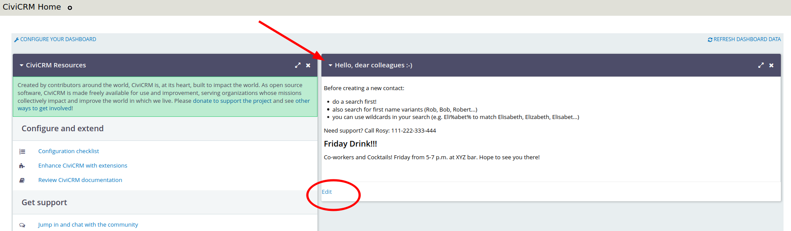
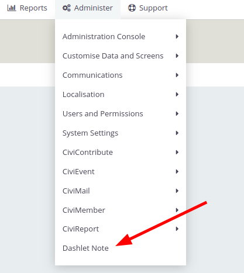
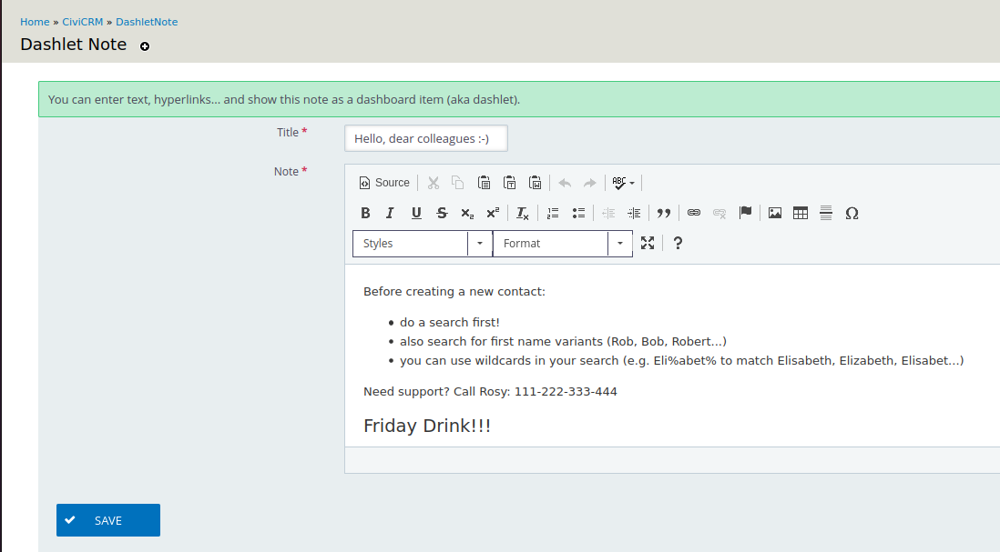
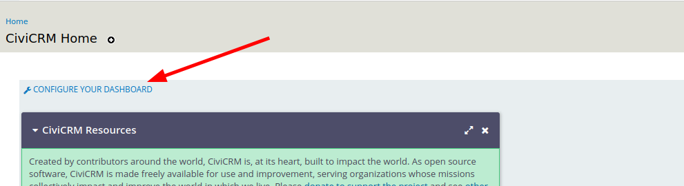
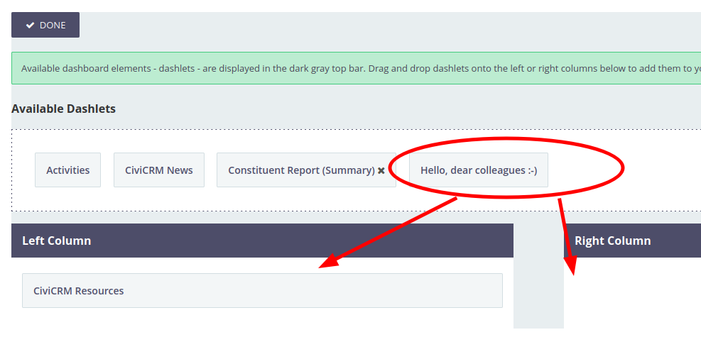

# Dashlet Note

## A Message to your Users on the Dashboard

***Dashlet Note*** lets you create a note in a rich text editor, and make this note available as a dashlet (i.e. a dashboard item).

This is an easy solution to show some static information on the dashboard, like:
* important phone numbers
* announcements
* shortcuts to certain pages
* ...

## Menu

You can create/edit your dashlet note via Administer > Dashlet Note

## Create the Note in the Note Editor

The note editor allows rich text like bullets, hyperlinks, bold text, images...

## Display the Note on the Dashboard

By clicking on "Configure your Dashboard" on the CiviCRM start page, users can drag and drop the dashboard note in the left or right column.

## License

The extension is licensed under [AGPL-3.0](LICENSE.txt).
